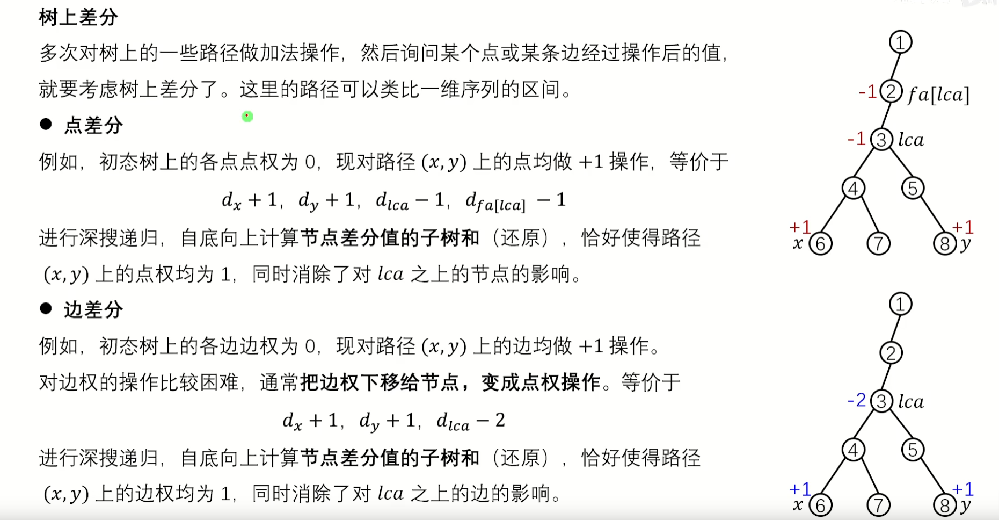
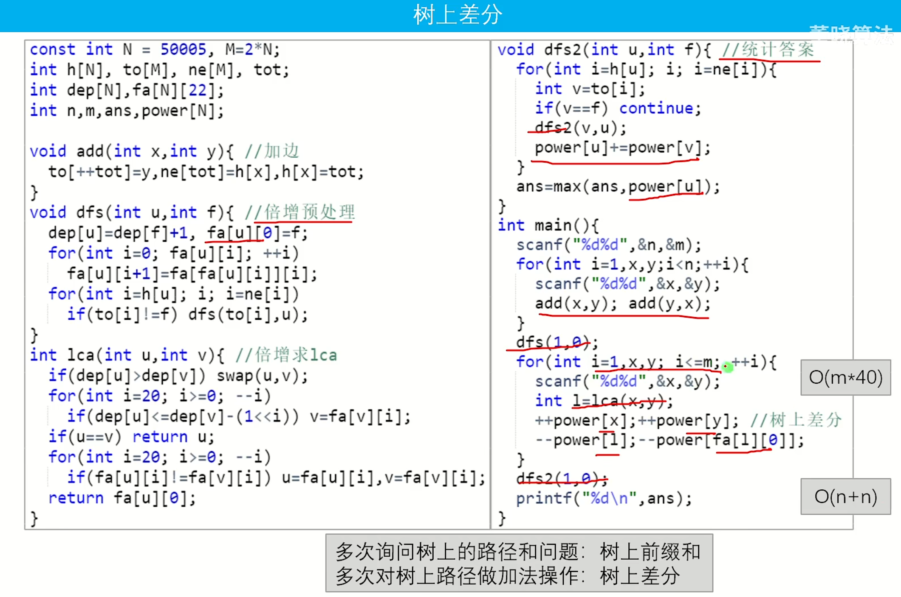

https://www.bilibili.com/video/BV1j14y1o7Rn/?spm_id_from=333.337.search-card.all.click&vd_source=632b900659c1954e964a52b4d43dc39b

相关例题

https://www.luogu.com.cn/problem/P3258 





```cpp
void dfs(int u,int f){
    for(auto &v : g[u]){
        if(v == f) continue;
        dfs(v,u);
        d[u] += d[v]; 
    }
} // 自底向上计算 树上差分 
```

